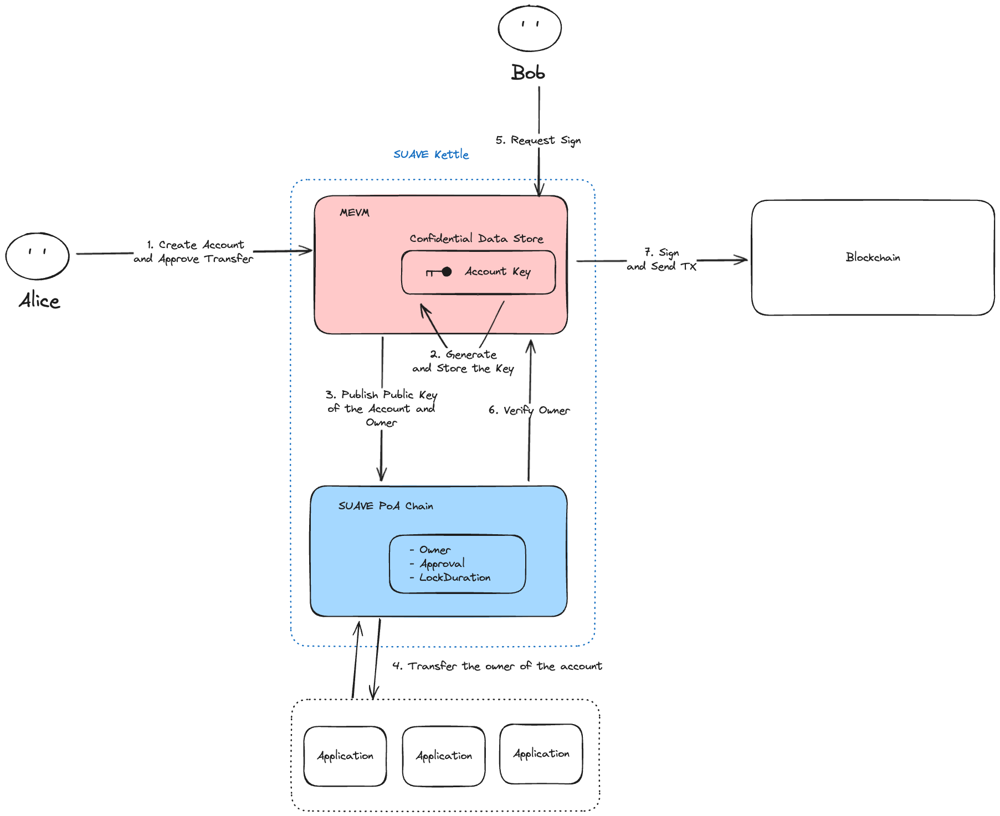

# Astraeus

Astraeus represents the foundational stage of Mycel's architecture, focusing on the implementation of Transferable Accounts. This phase is centered on establishing the core functionality that allows assets to move securely and efficiently across different blockchain platforms.

- Transferable Accounts with SUAVE: In this phase, the Transferable Account system is prototyped and tested within a controlled environment using SUAVE. The goal is to establish a reliable mechanism for moving and managing assets across different blockchain platforms.
- API Specification and Integration: Astraeus also involves defining and refining the API specifications that will allow developers to interact with the Mycel infrastructure. This API will form the backbone of all future development, ensuring that Mycel’s core functionalities are accessible and well-documented.
- Interoperability Testing: During this stage, initial tests are conducted to ensure that Transferable Accounts can operate smoothly across various blockchain platforms, validating the concept of cross-chain asset management.

Get start developing with Astraeus from here:
[Getting Started](/develop/astraeus/get-started)

## Architecture

Astraeus introduces a secure and decentralized infrastructure for managing Transferable Accounts using [SUAVE](https://suave-alpha.flashbots.net/). The architecture focuses on enabling the creation, transfer, and management of accounts in a confidential, transparent, and efficient manner, while leveraging key components like Kettle, MEVM and SUAVE.

**Components of Astraeus Architecture**

- SUAVE Kettles: a network of actors that provide confidential computation for SUAPPs. These all operate in Trusted Execution Environments (TEEs).
- Confidential Data Storage: a private place to store data (e.g. user transactions).
- SUAVE Chain: a public place to store data (e.g. intentionally leaked information) and SUAPP logic (e.g. deployed smart contracts).
  MEVM: a modified EVM that exposes confidential computation and storage APIs to developers

### Account Creation and Transfer

In the Astraeus system, Alice (the initial account holder) starts by creating a Transferable Account that can later be transferred to another user (Bob). This process is facilitated by SUAVE and involves several key steps:

1.  Create Account and Approve Transfer:

        Alice creates a request to create an account. The account is created in the Confidential Data Store within the MEVM layer of the SUAVE Kettle.

    The account creation process includes an approval step, where Alice grants permission for the account to be transferred to Bob to the application like DEX.

2.  Generate and Store the Account Key:

        Once the account is created, the MEVM generates an account key and securely stores it within its Confidential Data Store. This account key is critical for signing transactions and managing the account.

    The key remains hidden and is only accessible under specific conditions, ensuring security and privacy throughout the lifecycle of the account.

3.  Publish Public Key:

    The public key of the newly created account, along with the account ownership details, is published on the SUAVE Chain. This information is stored transparently on the chain, which maintains a record of ownership, approvals, and other account-related metadata (e.g., lock duration and transfer permissions).

4.  Transfer Ownership:

    After Alice approves the transfer to the application (suchas order flow auction), the application verifies the transfer conditions which are the account balance, the lock duration, and approvals. If the conditions are met, the ownership of the account is securely transferred from Alice to Bob by updating the state on the contract on SUAVE Chain.

### Interaction with SUAVE and Signing Transactions

Once the account has been transferred to Bob, Bob can use the account for transactions. SUAVE and the MEVM architecture facilitate this interaction securely and privately.

5. Request Signature:

   Bob initiates a transaction and requests a signature from the system to authenticate the operation. This request is sent to the SUAVE Kettle, which manages the confidential storage and execution environment.

6. Ownership Verification:

   Before generating the signature, the SUAVE Chain verifies that Bob is the current owner of the account. This verification involves checking the ownership information associated with the account.

7. Sign and Send Transaction:

   Once ownership is verified, the MEVM retrieves the account key from the Confidential Data Store, signs the transaction on behalf of Bob, and sends the transaction to the blockchain for execution.

## State Transition

The state transition of a Transferable Account in Astraeus follows a sequence of steps from account creation, locking, approving, signing, and ultimately transferring ownership. The diagram below outlines the various states and the possible transitions between them:

```mermaid
 stateDiagram-v2
    [*] --> Locked: CreateAccount()
    Locked--> ApprovedWithLock: ApproveAccount()
    Locked --> Unlocked: UnlockAccount()
    ApprovedWithLock --> Locked: RevokeAccount()
    ApprovedWithLock --> Unlocked: UnlockAccount()
    Unlocked --> Signed: RequestSign()
    Unlocked --> SignedAndDeleted: SignAndDeleteAccount()
    Unlocked --> Locked: LockAccount()
    Signed --> Unlocked

```

### `CreateAccount(owner)`

Create a traferable account Returns the public key of transferable account which is created

### `LockAccount(id, duration)`

Lock the transferable account

### `LockAccount(id, duration, to)`

Lock the transferable account and approve unlocking

### `UnlockAccount(id)`

Unlock the transferable account

### `ApproveAccount(id, to)`

Approve unlocking the transferable account to the party

### `RevokeApproval(id, to)`

Revoke the approval to unlocking the transferable account

### `RequestSign(id, data)`

Request a signature of the transferable account

### `RequestSignAndDeleteAccount(id, data)`

Request a signature of the transferable account and delete the key
