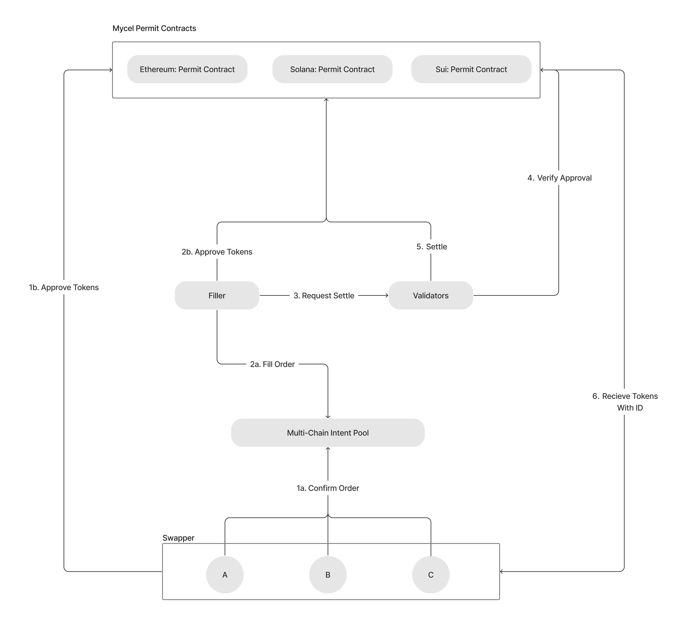

# Cross-chain Order Verifier

Cross-Chain Verifier plays a crucial role in Mycel's ID-based transfer system, ensuring the security and integrity of cross-chain transactions. It acts as the backbone of the system, validating approvals and facilitating seamless token swaps across different blockchains.

Key Components

- Validators: They play a critical role in ensuring the authenticity of token approvals and providing the necessary signatures for transactions.
- Permit Contract: A smart contract that swappers and fillers approve to authorize token transfers.
- Multi-Chain Intent Pool: A central repository where swappers submit their swap intents, allowing fillers to match these intents with their offerings.

1. Order Confirmation by Swappers:  
   Swappers submit their swap orders to the Multi-Chain Intent Pool, specifying the details of the swap, like "Swap 100USDC on Ethereum for SOL on Solana."
   Swappers approve their tokens for the swap via the Permit Contract and confirm their orders through the Intent Pool's API.

2. Order Fulfillment by Fillers:  
   Fillers, or liquidity providers, review the orders and confirm their ability to fulfill them, e.g., swapping 100USDC on Ethereum for 1 SOL on Solana.

3. Approval Request:  
   Once an order is matched, the Filler requests validation from validators to ensure that the Swapper has approved the token transfer.

4. Approval Verification:  
   Validators verify the Swapper's approval using RPC or light clients. If a majority (e.g., 2/3) of validators confirm, they sign off on the approval.

5. Transaction Preparation:
   Similar to Swappers, Fillers must also approve their tokens for the swap through the Permit Contract.

6. Swap Completion:  
   Either Fillers or Mycel Validators submit the transaction to the Permit Contract on each involved chain. This transaction includes the Filler's approval and the validators' signatures.
   If a Filler initiates the transaction, it is sent directly. If a Mycel Validator initiates, it is sent by a representative validator. The gas fee is covered by Mycel's Multisig/TSS Account, and the Filler compensates this with a network fee.

7. Token Receipt by Swappers:  
   Swappers receive their swapped tokens directly to their ID (e.g., "bob.cel"), eliminating the need for traditional wallet addresses until withdrawal.
