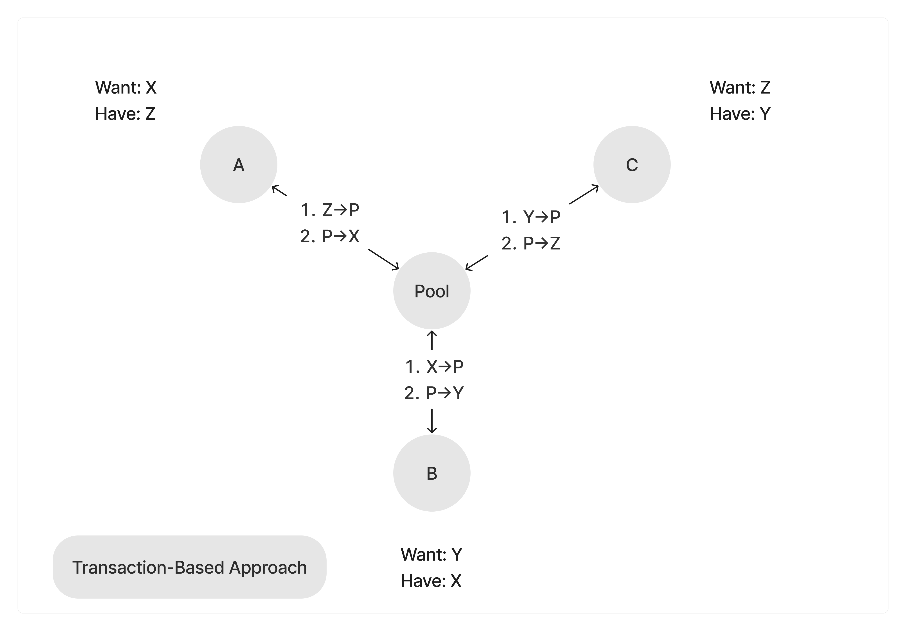
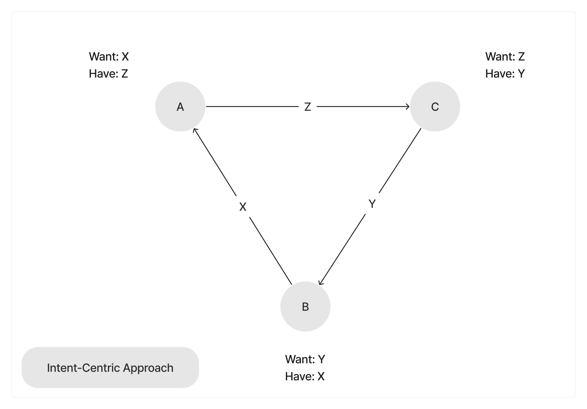

# Glossary

## Mycel ID

A unique digital identifier used within the Mycel platform, structured in a domain-like format with Top-Level Domains (TLD) and Second-Level Domains (SLD). Mycel IDs serve as a bridge between Web2 and Web3, allowing users to manage their digital identities seamlessly across multiple blockchain networks.

## Intents

In the context of software and blockchain technologies, an "intents" refers to a user's declared goal or desired outcome without specifying the procedural steps needed to achieve that outcome. It's a high-level declaration of what the user wants to do, such as sending tokens to someone, purchasing an item, or accessing a service. The concept of intent abstracts away the complexity of the operations required to fulfill these desires, focusing instead on the end result that the user wants to achieve.

Let's break down the scenario step by step for both the transaction-based approach and the intent-centric approach, using the example where Person A wants Z token, Person B wants X token, and Person C wants Y token.

**Transaction-Based Approach**:

1. Deposit Tokens into Pool:

   - A deposits X token into a pool and receives P token.
   - B deposits Y token into the same pool and receives P token.
   - C deposits Z token into the pool and receives P token.

2. Exchange P Tokens for Desired Tokens:

   - A uses P token to acquire Z token from the pool.
   - B exchanges P token for X token.
   - C exchanges P token for Y token.

3. Withdrawal:
   Each participant withdraws their desired tokens from the pool, completing the exchange process.

This approach requires all parties to first convert their tokens into a common intermediary (P token) before trading for their desired tokens, potentially incurring multiple transaction fees and slippage.

**Intent-Centric Approach**:

1. Expressing Intents:

   - A declares the intent to swap X token for Z token.
   - B declares the intent to swap Y token for X token.
   - C declares the intent to swap Z token for Y token.

2. Intent Matching and Execution:

   - The platform automatically identifies the cyclical match among the intents of A, B, and C.
   - Instead of converting tokens into a common intermediary, The platform orchestrates a direct swap based on the declared intents.

3. Direct Swap:
   - A directly receives Z token in exchange for X token.
   - B directly receives X token in exchange for Y token.
   - C directly receives Y token in exchange for Z token.

The intent-centric approach simplifies the process by directly matching the intents of participants in a circular manner, eliminating the need for an intermediary token and reducing the associated costs and complexity. This method allows for a more efficient and straightforward exchange, closely aligning with the users' initial desires and intentions.
