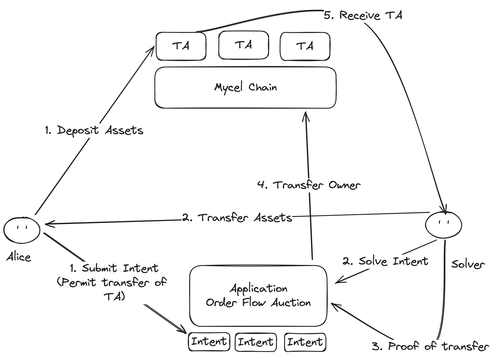

# What to Build

## Exchange assets across different blockchain platforms

Transferable Account serves as a gateway for interacting with native assets on any chain like Ethereum-based account-based chains (e.g., ERC-20 tokens) and Bitcoin-based UTXO-based chains (e.g., BTC)

1. Deposit Assets and Submit Intent:
   - Alice submits her intent, specifying the desired asset swap.
   - eg: exchanging 1 BTC on the Bitcoin network for ETH on the Ethereum network.
2. Intent Resolution and Asset Transfer:
   - The submitted intent is processed by a Solver, an entity responsible for matching and executing the swap
3. Transfer Validation
   - Application validates the asset transfer to ensure its integrity and correctness.
4. Update Ownership:
   - Upon successful validation, the ownership of the TA is transferred from the Swapper to the Solver.

## Transfer assets on any chain from smart contracts or rollups on any other chain

Transferable Accounts can be accessed and utilized from any chain using callback functions. This allows for seamless asset transfers and interactions between smart contracts or rollups on different chains. The steps involved in transferring ownership of a transferable account containing BTC from an Ethereum smart contract are as follows:

```mermaid
sequenceDiagram
    autonumber
    box Ethereum
        participant SC as Smart Contract
        participant AM as Mycel Contract
    end
    box Mycel
        participant V as Validators
        participant TSS as TSS Accounts
        participant M as Multisig Contract
    end
    box Bitcoin
        participant TA as Transferable Account
    end
    SC->>AM: Initiate transfer of TA ownership
    AM->>V: Notify validators of the transfer request
    V->>TSS: Collect signatures for ownership transfer
    V->>M: Execute transaction to update multisig contract
    M->>M: Update owner of Transferable Account
    V->>SC: Notify Ethereum smart contract of successful transfer
```

1. Initiate Transfer from Ethereum Smart Contract:
   A smart contract on Ethereum initiates the process by calling a function to transfer the ownership of a transferable account containing BTC.
2. Execute Callback Function on Mycel:
   Mycel's infrastructure triggers a callback function to process the ownership transfer of the TA.
3. Validator Confirmation:
   Validators on Mycel verify the transaction details and signatures to confirm the transfer request.
4. Update Ownership:
   Upon confirmation, the ownership of the Transferable Account is updated to the new owner specified by the Ethereum smart contract.
5. Notify Smart Contract:
   The Ethereum smart contract is notified of the successful ownership transfer.

## Buy and sell accounts tied to specific activities

Design an account activity market place where buyers and sellers can interact directly to buy, sell, or trade transferable accounts. This will enable parties to discover new trading opportunities and negotiate prices in a decentralized manner.
